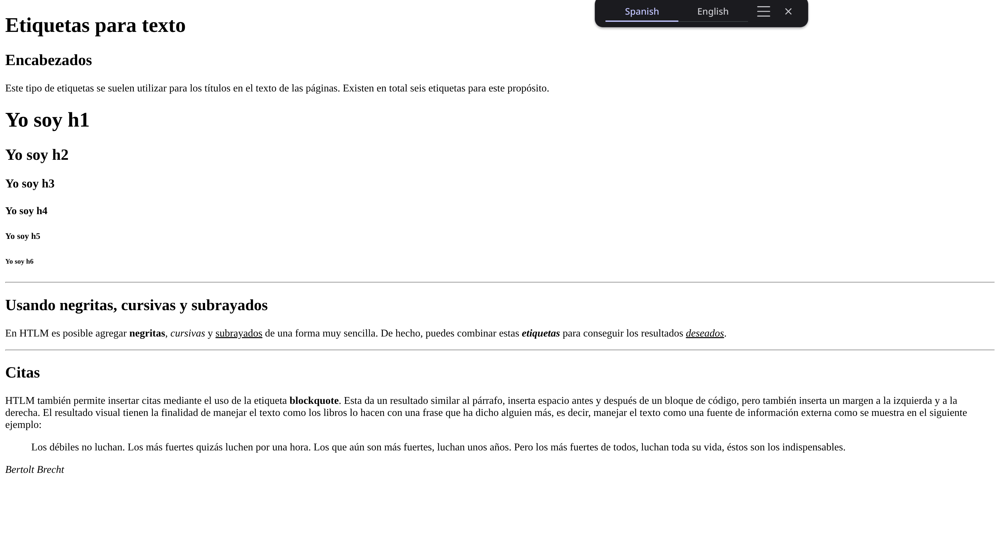
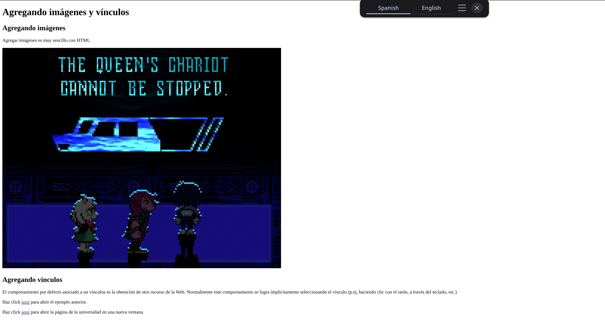

# Laboratorio 1

- Autor: Mauricio Montes

---

## Ejercicio 2

Captura de cómo se ve el sitio web:

> ¿Hay cambios en la visualización del sitio web? Si la respuesta es negativa, piense un momento. ¿Para qué sirven las etiquetas meta? Busque esa respuesta en la introducción de la guía o consulte con una búsqueda de su duda en Google.

No hay cambios visibles de agregar la etiquetas *meta*, pero esto es porque el cambio es en los *meta*datos del sitio web, algo que es muy importante para los buscadores y navegadores. De acuerdo a [w3school](https://www.w3schools.com/tags/tag_meta.asp), estos datos son entendidos a nivel informático, y dan indicaciones de qué palabras clave contiene el sitio web (para los buscadores), o cómo renderizar el sitio web.

---

## Ejercicio 3

Captura de cómo se ve el ejercicio 3 (zoom de 75% para visualización completa):

> Asegúrese de entender el valor del atributo src de la etiqueta img. ¿Qué pasaría si la imagen estuviera guardada en la misma carpeta de la página web? ¿Y si está en una carpeta superior?

El atributo *src* contiene la ruta de origen de la imagen, la fuente, *the source*. La ruta tiene que ser precisa, de otra forma se rompe la imagen. 
- Si la imagen estuviera en la misma carpeta que el html que lo usa, la ruta sería simplemente el nombre del archivo.
- Si la imagen estuviera en una carpeta superior, entonces se tiene que usar una ruta absoluta (mala idea) o una ruta relativa, usando "../" para moverse a una carpeta superior.